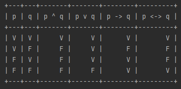
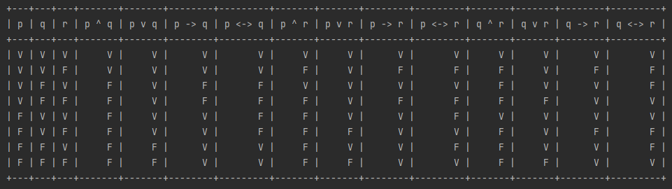

# Truth Table

## Sobre

Trabalho de tabela-verdade feito em Java, para a disciplina de _Resolução de Problemas com Lógica Matemática_ na PUCPR.

## Pedido

Crie um programa que recebe como entrada duas variáveis e imprime no console a tabela-verdade correspondente. O programa deve ser feito na linguagem Java ou C++ e deve utilizar os conceitos de orientação a objetos.

É preciso imprimir a tabela formatada no console, e o cabeçalho deve corresponder às variáveis que forem dadas como entrada. Ou seja, se as variáveis informadas forem p e q, o cabeçalho deve imprimir todas as proposições utilizando p e q como base.

## Instalando o projeto

```shell
# Clone este repositório
$ git clone git@github.com:Cassa-D/Tuth-Table.git

# Entre no diretório Truth-Table
$ cd Truth-Table
``` 

Jogue o arquivo `TruthTable.java` e `TestTruthTable.java` para dentro de sua IDE e adicione ao projeto a biblioteca [ASCII Table](https://code.google.com/archive/p/java-ascii-table/).

## Funcionalidade

Ao executar o programa (`TestTruthTable.java >> main()`) é mostrado toda a tabela verdade com as variáveis `p` e `q`.

Resultado:



> Para adicionar mais varáveis é só adicionar na linha 7 mais letras.
> 
> Exemplo com três variáveis:
> 
> 

---

__Desenvolvido por: [Cassiano Bitencourt](https://github.com/Cassa-D)__
